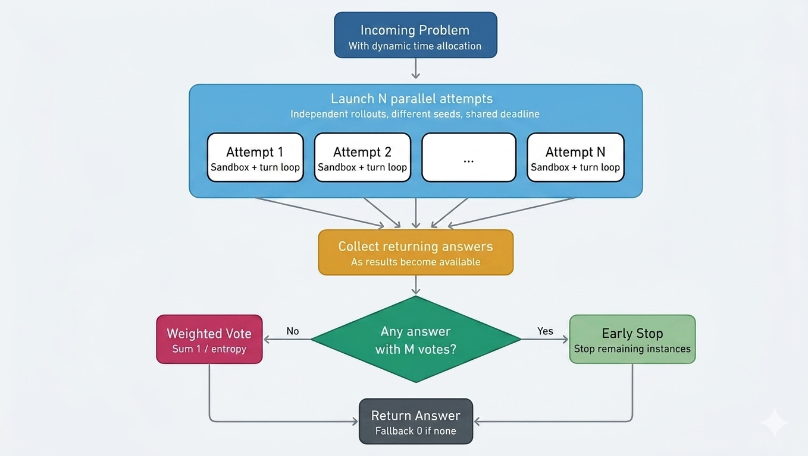

# AIMO-3 Solutions

## Overview

This repository collects several solution attempts for the [AI Mathematical Olympiad Progress Prize 3](https://www.kaggle.com/competitions/ai-mathematical-olympiad-progress-prize-3).

The competition asks participants to solve 50 IMO-level problems on a single NVIDIA H100 80GB GPU within a strict 5-hour wall-clock budget. The problems span algebra, combinatorics, geometry, and number theory. Answers are non-negative integers in the range `[0, 99999]` and are evaluated by exact match.

A key challenge is not only model quality, but also compute allocation. With 50 problems, a 5-hour limit, and roughly 10 minutes reserved for setup, each problem has only a few minutes available on average. For this reason, time management and adaptive search are first-class design concerns.

The final result achieved in this project was around the middle of the leaderboard, with **38/50 solved problems**.

## Repository contents

This repository includes multiple solution variants that share a common solver core:

- **[`aimo-3-gpt-oss-best-v0`](./scripts/aimo-3-gpt-oss-best-v0.ipynb)**: baseline code.
- **[`aimo-3-gpt-oss-best-v1`](./scripts/aimo-3-gpt-oss-best-v1.ipynb)**: half of the attempts use temperature `0.5`, the remaining half use `1.0`. Both the task prompt and the tool-usage prompt were refined.
- **[`aimo-3-gpt-oss-best-v2-different-strategies`](./scripts/aimo-3-gpt-oss-best-v2-different-strategies.ipynb)**: each attempt uses a different temperature. In addition, every attempt receives a base prompt enriched with a strategy prompt selected from a curated list. Each strategy follows a specific reasoning pattern such as brute force before proving, proof by contradiction, and similar approaches.
- **[`aimo-3-gpt-oss-two-phases`](./scripts/aimo-3-gpt-oss-two-phases.ipynb)**: an experiment designed to accelerate solving by splitting the total number of attempts into two phases. The first phase uses a base prompt and stops early if full agreement is reached. If not, the second phase continues with an extended prompt to generate more diverse answers before final voting.
- **[`aimo-3-gpt-oss-verification`](./scripts/aimo-3-gpt-oss-verification.ipynb)**: a verification stage is run after the parallel attempts. The model is asked to inspect the candidate answers and judge their correctness. This verification is repeated in parallel, and the resulting answers are added to the final vote pool.
- **[`aimo-3-qwen3-5`](./scripts/aimo-3-qwen3-5.ipynb)**: the same overall setup was reproduced with the Qwen/Qwen3.5-35B-A3B model and the Qwen-Agent stack. The experiment was limited by runtime, as this model proved significantly slower than `gpt-oss-120b`.

The best score is achieved by **[`aimo-3-gpt-oss-best-v0`](./scripts/aimo-3-gpt-oss-best-v0.ipynb)**, **[`aimo-3-gpt-oss-best-v1`](./scripts/aimo-3-gpt-oss-best-v1.ipynb)**, **[`aimo-3-gpt-oss-best-v2-different-strategies`](./scripts/aimo-3-gpt-oss-best-v2-different-strategies.ipynb)** notebooks.

## Common solver architecture

The shared solver is built around **[`openai/gpt-oss-120b`](https://huggingface.co/openai/gpt-oss-120b)** on a single H100 through vLLM.

For each problem, the system launches a fixed number of independently seeded attempts in parallel. Each attempt can interact with a stateful Jupyter sandbox through [`Openai Harmony`](https://github.com/openai/harmony.git) tool-use messages. Generation is streamed token by token. Whenever a closing brace `}` appears, the last tokens are scanned, and if `\boxed{...}` is detected, the attempt terminates immediately with that answer.

Once an attempt produces a final answer, it is pooled with the others. If multiple attempts agree on the same answer, the remaining attempts are cancelled early. Otherwise, the system waits for all attempts to complete and then selects the final response using an entropy-weighted voting strategy.

The total runtime is budgeted globally within the notebook limit of 17,400 seconds, which includes the estimated setup time (about 10 minutes). Each problem receives a base budget of 300 seconds, but this can extend up to 900 seconds when the remaining global budget allows it.

### Architecture diagram

*Figure: General solver architecture.*

## Model and vLLM configuration

| Parameter | Value | Notes |
| --- | --- | --- |
| Engine | vLLM 0.11.2 |  |
| Model | `openai/gpt-oss-120b` | [Hugging Face model page](https://huggingface.co/openai/gpt-oss-120b) |
| Total / active parameters | 116.8B / ~5.1B | Mixture-of-Experts model |
| Weight format | FP8 (MXFP4 E2M1) |  |
| KV cache | `fp8_e4m3` |  |
| Calculate KV scale | `False` |  |
| Tensor parallel | 1 | Single H100 |
| Max number of sequences | 8 |  |
| Max number of batched tokens | 8192 |  |
| GPU memory utilization | 0.96 |  |
| Context length | 65,536 to 85,000 |  |
| Stream interval | 50 |  |
| Logprobs | 6 | Used to compute entropy |
| Min-p | 0.02 to 0.08 |  |
| Top-p | 1.0 |  |
| Top-k | 100 | As suggested in the [gpt-oss run guide](https://unsloth.ai/docs/models/gpt-oss-how-to-run-and-fine-tune#run-gpt-oss-120b) |
| Temperature | 0.4 to 1.0 | Changed across experiments |
| Reasoning effort | High | [`Openai Harmony`](https://github.com/openai/harmony.git) library, model-specific |
| Seed | Random |  |
| Extra flags | `--async-scheduling` `--disable-log-stats` `--enable-prefix-caching` `--enable-chunked-prefill` | vLLM configuration flags |

## Turn loop

The model can reason freely, but it cannot execute Python code on its own. When it writes code inside a tool-call message and emits the hand-off token, generation stops so the orchestrator can run that code in a sandbox and feed the real output back.

Without this pause, the model would continue generating and would likely hallucinate the output. A turn is therefore one complete round of generation bounded by these hand-offs.

After each turn, the orchestrator inspects the last message:

- If it is a final-channel message, the boxed answer is extracted and the attempt ends.
- If it is a Python tool call, the code is executed in the sandbox and the real output is appended as a tool-response message before the next turn begins.

## Entropy-weighted voting

During generation, the model records the top log-probabilities at every token position. At the end of the attempt, each log-probability is converted to a probability via `exp`, and the Shannon entropy for that position is computed as:

`-sum(p_i * log2(p_i))`

The per-position entropies are then summed and divided by the token count to obtain the attempt's **mean entropy**. This produces a single confidence score, where lower values indicate a more consistent and confident generation.

Each attempt votes for its final candidate answer with weight `1 / mean_entropy`. The weights are summed per answer, and the answer with the highest total weight is selected.

## Prompting strategy

The model is prompted in parallel to solve each problem. Depending on the experiment, all attempts may receive the same prompt, or each attempt may receive a different prompt to explore complementary reasoning patterns and enlarge the search space.

In every case, the prompt includes the final-answer constraint:

> The final answer must be a non-negative integer between 0 and 99999.  
> Please reason step by step, and put your final answer within `\boxed{}`.

### Strategy prompts

In [`aimo-3-gpt-oss-best-v2-different-strategies`](./scripts/aimo-3-gpt-oss-best-v2-different-strategies.ipynb), each attempt is also enriched with a strategy prompt selected from a predefined list. These prompts encourage different solving styles, such as:

- brute force before proving;
- proof by contradiction;
- prove by induction;
- divide into cases;
- invariant-based reasoning.

## Python tool usage prompt

To enable Python tool use, the repository includes a prompt derived from the official [gpt-oss repository](https://github.com/openai/gpt-oss.git):

> Use this tool to execute Python code in your chain of thought. The code will not be shown to the user. This tool should be used for internal reasoning, but not for code that is intended to be visible to the user (for example, when creating plots, tables, or files). When you send a message containing Python code to python, it will be executed in a stateful Jupyter notebook environment. You have to use print statements to access the output.

In some experiments, this prompt was slightly adjusted to improve code execution reliability.

## Qwen/Qwen3.5-35B-A3B experiment

To test the same overall approach with a different model family, the solver was reproduced with **[`Qwen/Qwen3.5-35B-A3B`](https://huggingface.co/Qwen/Qwen3.5-35B-A3B)**from Hugging Face.

The code execution component from the official [Qwen-Agent repository](https://github.com/QwenLM/Qwen-Agent) was adapted to run inside a stateful notebook instead of a Docker container.

Although the model showed strong benchmark performance, it was significantly slower than `gpt-oss-120b` in this setup and could not complete a full submission within the time limit.

## Additional experiments and references

Some scripts include additional techniques or external references, such as:

- [Less is More: Improving LLM Reasoning with Minimal Test-Time Intervention](https://arxiv.org/abs/2510.13940)
- [Speculative decoding for `openai/gpt-oss-120b`](https://huggingface.co/nvidia/gpt-oss-120b-Eagle3-long-context)